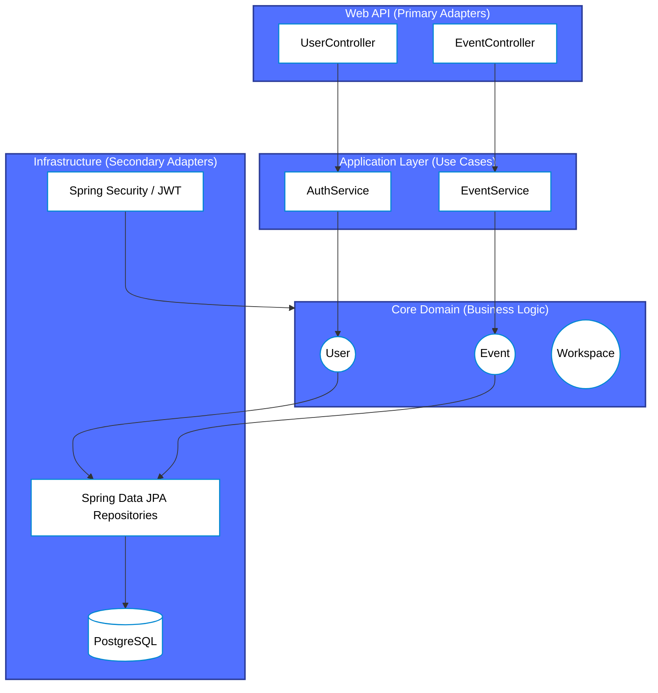
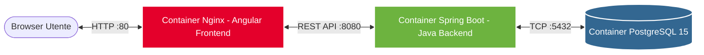

# HackHub: Progetto esame Applicazioni Web, Mobile e Cloud A.A. 2025/26

Sistema gestionale completo per la creazione e partecipazione ad Hackathon, sviluppato con Java (Spring Boot) e Angular.

## Panoramica

HackHub è una piattaforma full-stack che offre:
* **Registrazione:** Creazione account per Organizzatori, Studenti, Giudici e Mentori.
* **Autenticazione:** Accesso sicuro al sistema tramite token JWT.
* **Gestione Hackathon:** Creazione eventi, definizione regole e durata temporale degli eventi.
* **Gestione Staff:** Aggiunta di Giudici e Mentori agli eventi.
* **Visualizzazione:** Visualizzazione degli eventi e delle informazioni principali.

L'architettura segue i principi del **Domain-Driven Design (DDD)** e della **Hexagonal Architecture** (Ports & Adapters), garantendo modularità, testabilità e indipendenza dal framework. Il backend espone API RESTful protette.

## Architettura

Il progetto è modulare e organizzato in **Bounded Contexts** ben definiti (`identity`, `event`, `assessment`, `notification`, `workspace`). Ogni contesto adotta una stratificazione interna pulita:

* **API (Web)** --> Presentation layer con Controller REST Spring Boot che espongono gli endpoint.
* **Application** --> Business logic applicativa: Servizi, DTO, Mapper e orchestrazione dei casi d'uso.
* **Domain (Core)** --> Cuore del sistema: Entità, Value Objects e regole di business pure, agnostiche rispetto alla tecnologia.
* **Infrastructure** --> Implementazione tecnica: Repository (JPA/Hibernate), Security (Spring Security), Adapter esterni.
* **Test** --> Suite completa di Unit Test (JUnit 5, Mockito) e Integration Test.

### Diagramma Hexagonal Architecture



## Stack Tecnologico

* **Backend:** Java 21 | Spring Boot 3.3.4 | Spring Data JPA | Hibernate 6.5.3
* **Frontend:** Angular 21.1.3 | Bootstrap 5.3.8
* **Database:** PostgreSQL 15
* **Containerization:** Docker | Docker Compose
* **CI/CD:** GitHub Actions

## Automazione e CI/CD

Il progetto integra due pipeline automatizzate tramite **GitHub Actions** (configurate nella cartella `.github/workflows/`):

1. **Continuous Integration (`ci.yml`):** Ad ogni `push` sul branch `main`, il codice Java viene clonato e validato. La pipeline esegue l'intera suite di Test (`./gradlew test`) e, esclusivamente in caso di successo (verde), procede alla build dell'immagine Docker caricandola automaticamente su DockerHub.
2. **Continuous Deployment (`cd.yml`):** Innescata automaticamente al termine della CI. Si collega via SSH a un server di produzione remoto, rigira il `pull` delle ultime immagini Docker e riavvia i container tramite Docker Compose con azzeramento del downtime.

### Flusso Servizi Docker (Deployment)



## Sicurezza

* **Spring Security 6** —> Framework di autenticazione e controllo accessi
* **JWT (JSON Web Token)** —> Autenticazione stateless
* **BCrypt** —> Hashing sicuro delle password
* **Role-Based Authorization** —> Controllo accessi granulare (organizzatore, studente, giudice, mentore)

## Funzionalità Backend

### Gestione Utenti
Il sistema supporta diversi attori, ognuno con permessi specifici:
* **Organizzatore:** Crea e gestisce gli Hackathon, definisce le regole e monitora l'andamento.
* **Studente:** Si iscrive agli eventi, forma team e lavora ai progetti nel workspace.
* **Giudice:** Valuta i progetti sottomessi dai team al termine dell'evento.
* **Mentore:** Supporta i team durante lo sviluppo.

### Core Domain (Hackathon)
* **Gestione Eventi:** Definizione completa del ciclo di vita dell'Hackathon (date, regole, temi).
* **Team Building:** Gli studenti possono creare team o unirsi a squadre esistenti per partecipare alle competizioni.
* **Assessment:** Sistema di valutazione flessibile per decretare i vincitori.

### Workspace di Progetto
Ogni team dispone di un'area di lavoro dedicata per tracciare il progresso:
* **Meeting & Report:** Registrazione degli incontri di team e reportistica sulle attività svolte.
* **Monitoraggio:** Gli organizzatori possono supervisionare l'attività dei team in tempo reale.

## Modello Dati

| Entità | Descrizione |
|---|---|
| **User** | Utenti autenticati con dati anagrafici, credenziali (hash) e ruolo (PlatformRoles). |
| **Event** | Hackathon con regolamento, stato e periodo di svolgimento. |
| **Assignment** | Associazione tra un membro dello staff e un evento. |
| **Workspace** | Area di lavoro digitale assegnata a un team per un specifico evento. |
| **Meeting** | Incontri pianificati tra il team e il mentore assegnato. |
| **Ticket** | Utilizzato per la gestione di meeting (Open, In Progress, Closed). |
| **Report** | Segnalazione di un team per la violazione del regolamento. |
| **Assessment** | Valutazione formale di un progetto da parte di un giudice. |
| **Winner** | Team vincitori calcolati al termine dell'evento. |

## API Endpoints

### UserController
`Base URL: /api/user`

| Metodo | Endpoint | Descrizione |
|---|---|---|
| POST | `/signup` | Registrazione di un nuovo utente nel sistema. |
| POST | `/login` | Autenticazione utente e rilascio token JWT. |
| POST | `/logout` | Possibilità di logout dell'utente dopo aver effettuato il login. |
| GET | `/role/{role}` | Restituisce tutti gli utenti aventi uno specifico ruolo (es. `JUDGE` o `MENTOR`). |

### EventController
`Base URL: /api/event`

| Metodo | Endpoint | Descrizione |
|---|---|---|
| GET | `/active` | Restituisce la lista degli Hackathon attivi. |
| GET | `/organizer` | Restituisce la lista degli Hackathon creati da uno specifico organizzatore. |
| POST | `/` | Crea un nuovo evento (solo Organizzatore). |
| DELETE | `/{id}` | Esegue il soft-delete di un evento in stato SUBSCRIPTION (solo Organizzatore). |
| PATCH | `/{id}/close-sub` | Chiude le iscrizioni all'evento e lo passa in stato WAITING. |
| PATCH | `/{id}/start` | Avvia ufficialmente l'evento. |
| PATCH | `/{id}/stop` | Termina l'evento e avvia la fase di valutazione. |
| GET | `/{id}/details` | Restituisce i dettagli completi dell'evento, incluso lo Staff assegnato. |

### StaffController
`Base URL: /api/staff`

| Metodo | Endpoint | Descrizione |
|---|---|---|
| POST | `/judge` | Aggiunge un utente esistente come Giudice a un hackathon (solo Organizzatore). |
| POST | `/mentor` | Aggiunge un utente esistente come Mentore a un hackathon (solo Organizzatore). |

## Avvio

### Prerequisiti
* **Docker Desktop** (installato e in esecuzione)
* **Git** (per clonare il repository)

*(Nota: Java, Node o PostgreSQL non sono richiesti, poiché Docker si occuperà di scaricare e isolare automaticamente tutti gli ambienti necessari).*

### Installazione

```bash
# Clona il repository
git clone https://github.com/LorenzoSarti22/HackHubApplication.git

# Naviga nella directory
cd HackHubApplication
```

*Avvertenza per l'avvio: È **fondamentale** avviare sempre e prima il Backend rispetto al Frontend. Questo permette ai container Docker del Database PostgreSQL di crearsi e inizializzarsi correttamente prima che il server Angular tenti la connessione ai servizi REST.*

### Avvio Backend (Spring Boot)

```bash
cd hackHub

# Avvia l'intero stack backend (DB + App) tramite Docker:
docker compose -f docker-compose-be.yml up -d --build
```

### Avvio Frontend (Angular)

```bash
cd ..
cd frontend

# Avvia il frontend compilato per la produzione tramite Docker
docker compose -f docker-compose-fe.yml up -d --build

# Esposta su: http://localhost
```

### Test

```bash
# Naviga nel backend ed esegui la suite di test
cd hackHub
./gradlew test
```

## Guida Rapida all'Uso

Per testare le funzionalità principali del sistema seguendo il flusso corretto, vi consigliamo questi step passo-passo:

1. **Creazione Account (Staff):** andare sulla piattaforma (`http://localhost`) e registrare due nuovi utenti selezionando rispettivamente il ruolo di **Mentore** (`MENTOR`) e **Giudice** (`JUDGE`).
2. **Accesso Organizzatore:** Registrare un nuovo utente col ruolo di **Organizzatore** (`ORGANIZER`) ed effettuare l'accesso con quest'ultimo.
3. **Creazione Evento:** Dal menu di navigazione, cliccare su "Gestisci Hackathon" per accedere all'Area Organizzatore, poi su "Nuovo Hackathon" e compilare il form per creare il primo evento.
4. **Assegnazione Staff:** Sempre nell'Area Organizzatore, comparirà il nuovo evento. Cliccare sull'icona della **Matita (Gestisci)** a destra. Si aprirà il modale di gestione in cui si potrà selezionare dal menu a tendina il Giudice e il Mentore creati al Passo 1, assegnandoli ufficialmente all'evento.
5. **Apertura Iscrizioni:** Nello stesso modale, si potrà cambiare lo stato dell'evento (fino allo stato EVALUATING).
6. **Visualizzazione Pubblica:** Tornando nella Homepage e cliccando su "Hackathon Attivi" si potrà vedere l'evento appena creato (con lo staff visibile) apparire pubblicamente.
